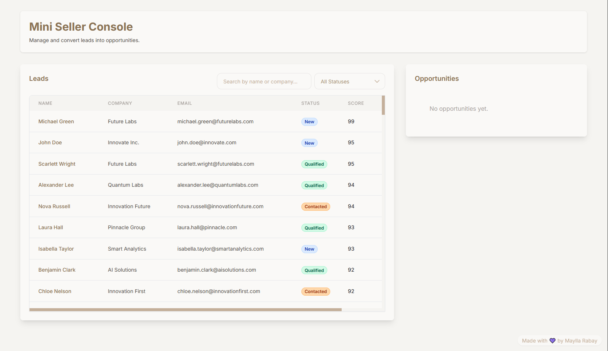
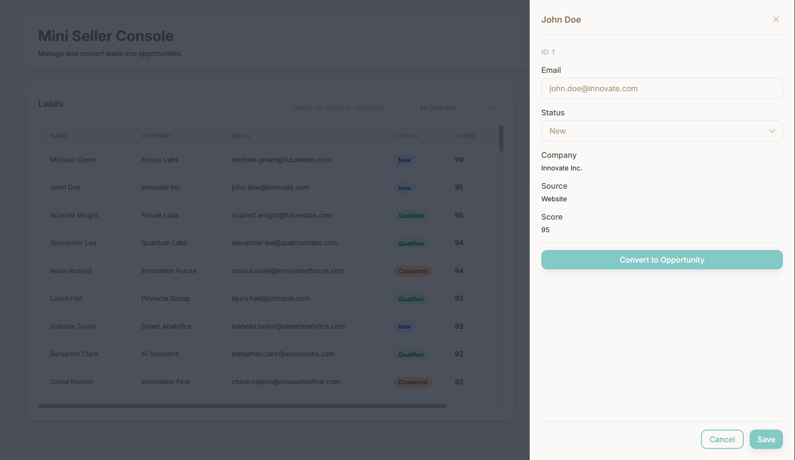
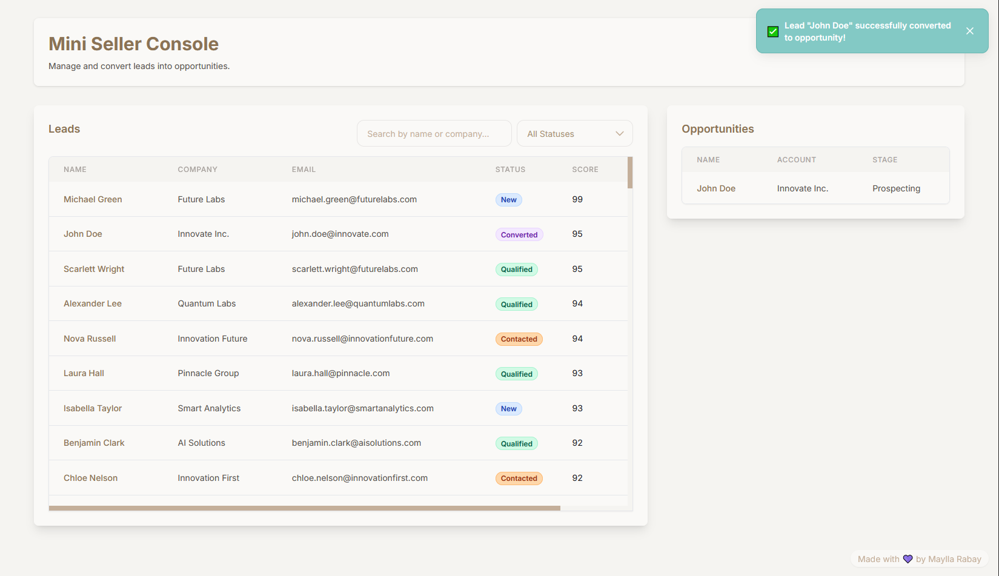
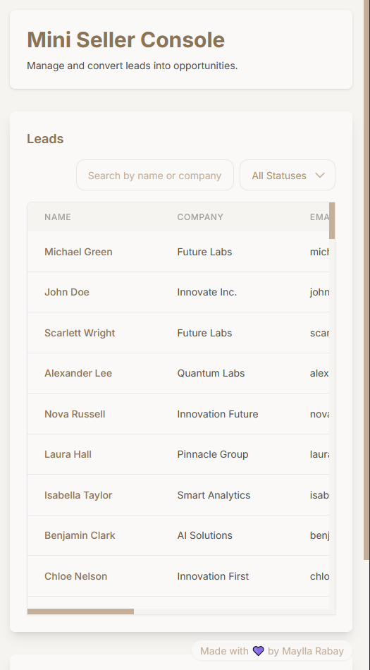

<h1 align="center"> 
	🛠️ Mini Seller Console
</h1>

## 💻 About the Project

A lightweight console to triage **Leads** and convert them into **Opportunities**.

> 🚀 **[Live Demo](https://mini-seller-project.vercel.app/)** | 🧪 **35 Tests Passing** | ✨ **Clean Architecture**

## 📸 Screenshots

- 📋 Main dashboard with leads list
  
- 📝 Lead detail panel (slide-over)
  
- 💼 Opportunities management
  
- 📱 Mobile-responsive design
  <br />
  

## 📋 Features (MVP)

### Leads List

- Load from data file, simmulating a local JSON file.
- Fields: `id, name, company, email, source, score, status`.
- **Search** (by name/company).
- **Filter** (by status).
- **Sort** (by score, descending).

### Lead Detail Panel

- Click on a row to open a slide-over panel.
- Inline edit: **status** and **email** (with validation).
- Save/cancel actions with basic error handling.

### Convert to Opportunity

- Button **Convert Lead**.
- Creates Opportunity with fields:
  - `id, name, stage, amount (optional), accountName`.
- Show Opportunities in a simple table.

### UX & States

- Loading state.
- Empty state.
- Basic error handling.
- Handle ~100 leads smoothly.

### Nice-to-Haves Implemented

- [x] Persist filter/sort in **localStorage**
- [x] **Optimistic updates with rollback on failure**
- [x] Responsive layout (desktop → mobile)

### Project Structure

```
src/
├── ui/ (Design System - Base)
├── managers/ (Business Logic - Core)
├── hooks/ (React Integration - Bridge)
├── components/ (Domain Components - Application)
├── types/ (Shared Types)
├── utils/ (Shared Utilities)
├── data/ (Initial Data)
└── mocks/ (Test Fixtures)
```

## 💡 Prerequisites for Running the Project

- Install [**Git**](https://git-scm.com).
- Install [**Node.js**](https://nodejs.org/en/).
- Install [**VSCode**](https://code.visualstudio.com/download) or [**Neovim**](https://neovim.io/).

## ▶️ Running the Project

1. Open your terminal and clone this repository:

```bash
git clone https://github.com/MayllaRabay/mini-seller-console.git
```

2. Navigate to the project folder:

```bash
cd mini-seller-console
```

3. Download all application dependencies and packages:

```bash
npm install
```

4. Run the application in development mode:

```bash
npm run dev
```

5. The application will open on port 5173. Access it in your browser:
   http://localhost:5173

## 🔧 Technologies Used

- [](https://create-react-app.dev/docs/getting-started/)
- [](https://tailwindcss.com/)
- [](https://www.typescriptlang.org/docs/)

## 📜 Available Scripts

| Command            | Description              |
| ------------------ | ------------------------ |
| `npm run dev`      | Start development server |
| `npm run build`    | Build for production     |
| `npm run preview`  | Preview production build |
| `npm run test`     | Run tests in watch mode  |
| `npm run test:run` | Run all tests once       |
| `npm run lint`     | Check code quality       |

## 🧪 Testing

The project includes **35 comprehensive tests** covering:

- ✅ Business logic (LeadManager)
- ✅ React integration (useLeadManager hook)
- ✅ Optimistic updates with rollback
- ✅ State management and persistence

Run tests with: `npm run test`

## 🏗️ Architecture Highlights

- **🔄 Optimistic Updates**: Immediate UI response with automatic rollback on failure
- **📦 Clean Architecture**: Separation between UI, business logic, and data
- **🎨 Design System**: Reusable UI components with custom Tailwind theme
- **⚡ Performance**: Efficient state management and re-rendering
- **🧪 Testable**: 35 tests ensuring reliability

### Made with 💜 by Maylla Rabay
